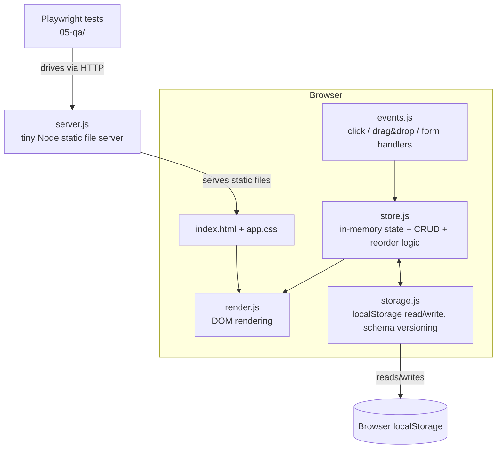

# Architecture — trello-clone

## Summary

A single-page, client-only Trello clone. No backend business logic, no database, no build step. A tiny static file server exists only so the app runs at `http://localhost` (required for `fetch`/module loading and for Playwright to have a URL to visit) — it serves static files and nothing else. All state lives in the browser's `localStorage`; there is no network API.

This deliberately amends the "Tech Stack Decision" sketched in `01-understand/requirements.md` (React SPA + Vite). Nothing in the approved requirements *requires* a framework or a build step — FR1-FR14 and all NFRs are satisfied by plain HTML/CSS/JS. Given NFR5 ("codebase small enough to be built and reviewed incrementally... prefer a single frontend app") and the project's tiny-build-loop nature, a build-tool-free stack is simpler to hold in one head, has zero install/compile step, starts with one command, and is trivially driven by Playwright (real DOM, real native HTML5 Drag and Drop API, no virtual-DOM diffing to fight in tests). This is an explicit architecture-level decision superseding the requirements doc's tech-stack sketch; the product intent (single-user, client-side, localStorage) is unchanged.

## Component Overview



## Components

| Component | File | Responsibility |
|---|---|---|
| Static server | `04-build/src/server.js` | Node's built-in `http` module serves `index.html`, `app.css`, and the JS modules from `04-build/src/public/`. No routing, no API endpoints, no dependencies. |
| Markup/styles | `04-build/src/public/index.html`, `app.css` | Page skeleton (boards view, board view, card-detail modal templates) and layout/visual styling. |
| Store | `04-build/src/public/js/store.js` | Single source of truth: in-memory object graph of `{boards, lists, cards}`, plus pure functions for create/rename/delete/reorder/move. No DOM code. |
| Persistence | `04-build/src/public/js/storage.js` | Serializes/deserializes the store to/from `localStorage` under one versioned key; called by `store.js` after every mutation and on load. |
| Renderer | `04-build/src/public/js/render.js` | Reads current store state and re-renders the relevant DOM subtree (boards list, lists+cards, modal). Pure "state in, DOM out" — no business logic. |
| Event wiring | `04-build/src/public/js/events.js` | Attaches click handlers (create/rename/delete/open-card, "Move to..." fallback menu) and native HTML5 Drag-and-Drop handlers (`dragstart`/`dragover`/`drop`) that call into `store.js`, then trigger a re-render. |
| Entry point | `04-build/src/public/js/app.js` | Boots the app: loads persisted state via `storage.js`, does initial `render.js` call, registers `events.js` listeners. Loaded as an ES module from `index.html`. |

No framework, no bundler, no transpile step: `index.html` loads `app.js` directly via `<script type="module">`; ES modules give file-level separation without build tooling.

## Functional Requirement → Component Mapping

| Requirement | Component(s) |
|---|---|
| FR1 Create/view/rename/delete boards | `events.js` (UI actions) → `store.js` (mutations) → `render.js` (boards list view) |
| FR2 Create/rename/delete lists | `events.js` → `store.js` → `render.js` (board view) |
| FR3 Create/rename/delete cards | `events.js` → `store.js` → `render.js` (list/card view) |
| FR4 Reorder cards within a list (DnD) | `events.js` drag handlers → `store.js` reorder fn → `render.js` |
| FR5 Move cards between lists (DnD) | `events.js` drag handlers → `store.js` move fn → `render.js` |
| FR6 Reorder lists within a board (DnD) | `events.js` drag handlers → `store.js` reorder fn → `render.js` |
| FR6a Click-based "Move to..." fallback | `events.js` (dropdown menu handler) → `store.js` move/reorder fn (same functions DnD uses) |
| FR7 Persist across reloads | `storage.js` (write-through on every `store.js` mutation; read on `app.js` boot) |
| FR8 Card detail view with description | `render.js` (modal template) + `events.js` (open/save handlers) → `store.js` |
| FR9 Reorder boards | `events.js` drag handlers on boards list → `store.js` reorder fn → `render.js` |
| FR10 Empty states | `render.js` (conditional templates when a collection is empty) |
| FR11 Confirm before destructive actions | `events.js` (native `confirm()` before calling delete in `store.js`) |
| FR12 Card labels/colors (Could) | `store.js` (extra card field) + `render.js` (badge) + `events.js` (color picker) — additive, no new component |
| FR13 Card due dates (Could) | `store.js` (extra card field) + `render.js` + `events.js` — additive |
| FR14 Keyword search/filter (Could) | `events.js` (search input handler) + `render.js` (filtered view); no store mutation needed |

Every Must/Should requirement maps to existing components; no requirement needs a new component, satisfying the "handful of files" constraint.

## Data Flow

1. **Boot**: `app.js` calls `storage.js` to read the versioned JSON blob from `localStorage` (or seeds an empty `{boards: [], lists: [], cards: []}` structure if absent) and hands it to `store.js` as initial state.
2. **Initial render**: `app.js` calls `render.js` once with the loaded state to paint the boards list (or board view, if one was open).
3. **User interaction**: a click or drag-and-drop event fires in the DOM; `events.js` handlers translate it into a call on `store.js` (e.g., `store.createCard(listId, title)`, `store.moveCard(cardId, toListId, toIndex)`).
4. **Mutation**: `store.js` updates its in-memory state, then immediately calls `storage.js` to persist the full state back to `localStorage` (write-through, no debouncing needed at this data scale).
5. **Re-render**: `store.js` (or the calling event handler) triggers `render.js` to re-render the affected view from the updated state. DnD reordering updates local DOM/state optimistically before persistence completes (NFR2), but since persistence is synchronous `localStorage.setItem`, there is no real async gap in practice.
6. **Reload**: browser reload restarts at step 1; because `localStorage` is durable, all boards/lists/cards/order survive (FR7).

There is no server-side state and no network requests after the initial page load — the "API" is purely in-process function calls between `events.js`, `store.js`, and `storage.js`.

## Tech Stack

| Choice | Justification |
|---|---|
| Plain HTML/CSS/JS (ES modules), no framework | Satisfies every FR/NFR without one; smallest possible codebase for a single developer agent to hold in its head (NFR5); zero build step to debug. |
| Node.js built-in `http` module for the dev server, no Express/Vite/webpack | One command (`node src/server.js`) starts serving; zero dependencies to install, version, or break; still gives Playwright a real `http://localhost:PORT` URL to drive. |
| `localStorage` for persistence | Matches approved requirements/assumptions (client-only, single-user, no backend); native browser API needs no library. |
| Native HTML5 Drag and Drop API for FR4-FR6/FR9 | Built into every target browser (NFR1); avoids a DnD library dependency; directly testable by Playwright's `dragTo()`/dispatch-event helpers. |
| Playwright for QA | Already specified by the project's testing approach; works unmodified against plain DOM/real drag events, no framework-specific test adapters needed. |

## Running Locally

```
node 04-build/src/server.js
```

Starts the static server (default port, e.g. `3000`) serving `04-build/src/public/`. Open `http://localhost:3000` in a browser — no build, no install (zero npm dependencies for the app itself). `package.json`'s `dev`/`start` script wraps this same command as the one-command entry point (`npm start`). Playwright tests (`05-qa/`) point their `baseURL` at the same server, which `test-writer`/`qa-engineer`/`ui-tester` can launch programmatically (e.g., via Playwright's `webServer` config running `node src/server.js`) so `npx playwright test` is itself a one-command flow.
